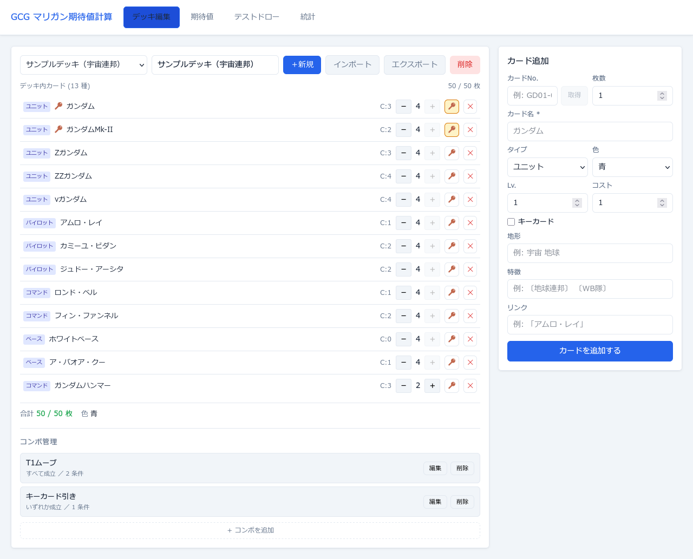
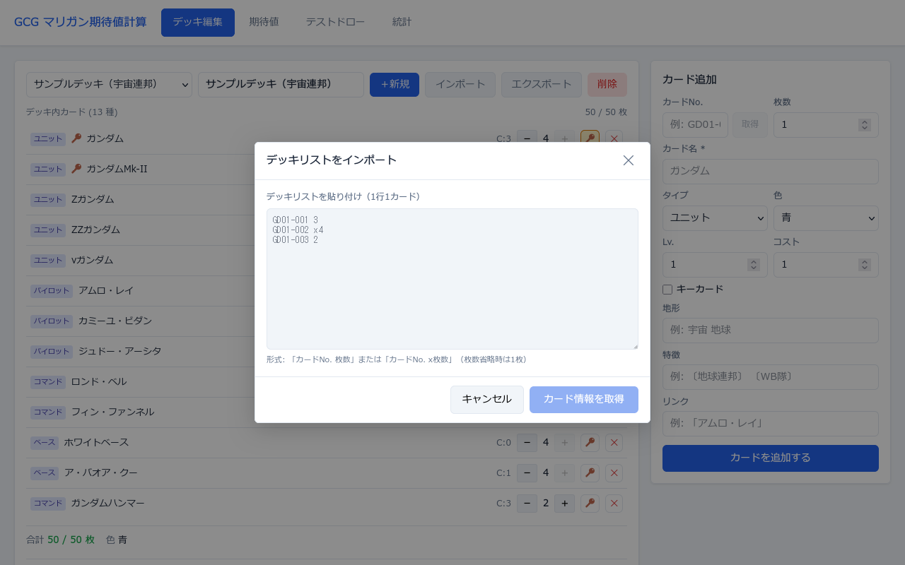
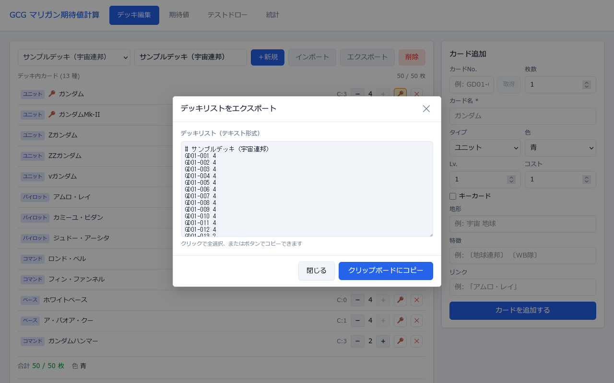

# デッキ編集タブ

デッキの作成・管理・カード登録・コンボ設定を行う画面です。

---

## 画面全体



左ペインにデッキリストとコンボ管理、右ペインにカード追加フォームを配置した2カラムレイアウトです。

---

## デッキ管理バー


画面上部のバーでデッキの選択・作成・削除を行います。

| ボタン / 要素 | 動作 |
|---|---|
| **デッキ選択ドロップダウン** | 保存済みデッキを切り替える。切り替えると全タブの表示が更新される |
| **デッキ名入力欄** | 選択中デッキの名前をリアルタイムで変更する |
| **＋新規** | 「新デッキ」という名前の空デッキを作成する。5件上限時はグレーアウトして押せなくなる |
| **インポート** | インポートモーダルを開く（後述） |
| **エクスポート** | エクスポートモーダルを開く（後述） |
| **削除**（赤） | 選択中のデッキを削除する。削除後はデッキ未選択状態になる |

---

## デッキリスト（左ペイン）

デッキ内の全カードを一覧表示します。各行に以下のコントロールがあります。

| ボタン / 要素 | 動作 |
|---|---|
| **タイプバッジ**（青いラベル） | カードタイプ（ユニット／パイロット／コマンド／ベース）を表示。クリック操作なし |
| **🔑 アイコン**（カード名左） | キーカード設定済みのカードに表示。クリック操作なし |
| **カード名** | クリック操作なし。表示のみ |
| **C:N**（右側数値） | カードのコスト値。表示のみ |
| **−** ボタン | 枚数を1減らす。1枚のときは押せなくなる |
| **枚数表示**（数字） | 現在のデッキ内枚数。表示のみ |
| **＋** ボタン | 枚数を1増やす。4枚上限またはデッキ50枚上限に達したとき押せなくなる |
| **🔑**（鍵アイコンボタン） | キーカードのON/OFFを切り替える。ON時は黄色くハイライト |
| **✕**（赤いボタン） | カードをデッキから削除する |

### デッキサマリー（リスト下部）

| 表示 | 内容 |
|---|---|
| **合計 N / 50 枚** | 合計枚数。50枚のとき緑色、それ以外は赤色で表示 |
| **色 ○○** | デッキで使用している色の一覧 |
| **⚠ エラーメッセージ**（赤字） | 50枚超・同一カードNo.が4枚超・3色以上のいずれかに該当する場合に表示 |

---

## カード追加フォーム（右ペイン）

右ペインからカードを1枚ずつデッキに追加します。

| フィールド | 入力内容 |
|---|---|
| **カードNo.** | 例: `GD01-001`。省略すると「カード名」で代用される |
| **取得**（ボタン） | カードNo.を入力した状態で押すと公式サイトから情報を自動取得し、以下の全フィールドを補完する。取得中は「取得中…」と表示。失敗時はエラーメッセージを表示 |
| **枚数** | 追加する枚数（1〜4）。スピナーで入力 |
| **カード名** | 必須項目。テキスト入力 |
| **タイプ** | ユニット／パイロット／コマンド／ベースから選択 |
| **色** | 青／緑／赤／紫／白から選択 |
| **Lv.** | 0以上の整数。スピナーで入力 |
| **コスト** | 0以上の整数。スピナーで入力 |
| **キーカード** | チェックボックス。チェックするとキーカード確率の計算対象になる |
| **地形** | 任意。例: `宇宙 地球`。取得ボタンで自動補完 |
| **特徴** | 任意。例: `〔地球連邦〕 〔WB隊〕`。取得ボタンで自動補完 |
| **リンク** | 任意。例: `「アムロ・レイ」`。取得ボタンで自動補完 |
| **カードを追加する**（青いボタン） | 入力内容を検証してデッキに追加する。バリデーションエラーがある場合はフォーム下部にエラー一覧を表示 |

---

## インポートモーダル



テキスト形式のデッキリストを貼り付けてカードを一括登録します。

### 対応フォーマット（1行1カード）

```
GD01-001 3
GD01-002 x4
GD01-003          ← 枚数省略時は1枚
# この行は無視   ← # または // で始まる行はコメント
```

| ボタン | 動作 |
|---|---|
| **カード情報を取得**（青） | テキストを解析してカードNo.と枚数を抽出し、公式サイトから各カードの情報を逐次取得する。取得中は各行に「取得中…」「取得完了」「取得失敗」のステータスを表示する |
| **デッキにインポート（N枚種）**（青） | 取得完了したカードのエントリで現在のデッキを上書きする。取得失敗したカードはスキップされる。実行後モーダルが閉じる |
| **キャンセル** | 処理を中断してモーダルを閉じる。取得中の場合も中断する |
| **✕**（右上） | キャンセルと同じ |

> **注意:** インポートは現在のデッキリストを**上書き**します。実行前に「現在のデッキリストは上書きされます」という警告が表示されます。

---

## エクスポートモーダル



現在のデッキリストをテキスト形式で出力します。

### 出力フォーマット

```
# デッキ名
GD01-001 3
GD01-002 4
```

| ボタン | 動作 |
|---|---|
| **クリップボードにコピー**（青） | テキスト全体をクリップボードにコピーする。成功後2秒間「コピーしました！」と表示される |
| **閉じる** | モーダルを閉じる |
| **✕**（右上） | 閉じると同じ |

テキストエリアをクリックすると全テキストが選択状態になります。出力テキストはインポートと互換性があり、そのまま貼り直して使用できます。

---

## コンボ管理

デッキリストの下部に表示されます。デッキに紐付くコンボ条件を登録・管理します。

### コンボ一覧

| ボタン | 動作 |
|---|---|
| **編集** | 選択したコンボの編集フォームを開く。他のコンボを編集中のときは押せない |
| **削除** | 選択したコンボを削除する。他のコンボを編集中のときは押せない |
| **＋ コンボを追加** | 新規コンボの作成フォームを開く。デッキにカードがない場合は押せない |

### コンボ編集フォーム

| 要素 | 動作 |
|---|---|
| **コンボ名入力欄** | コンボの名前を入力する |
| **AND（すべて成立）**ボタン | 登録した全条件がすべて手札に揃ったときをコンボ成立とする |
| **OR（いずれか成立）**ボタン | 登録した条件のどれか1つでも手札に揃えばコンボ成立とする |
| **＋ 条件を追加** | コンボ条件を1つ追加する |

### コンボ条件の種類

**カード指定**

| 要素 | 動作 |
|---|---|
| 種別セレクト（「カード指定」） | 特定のカード1枚を条件対象にする |
| カード名セレクト | デッキ内のカードを選択する。すでに他の条件で使用中のカードは選択肢から除外 |
| 枚数セレクト（N枚以上） | 手札に何枚以上必要かを指定（1〜そのカードのデッキ内枚数） |

**属性指定**

| 要素 | 動作 |
|---|---|
| 種別セレクト（「属性指定」） | タイプ・色・レベル・コストの組み合わせで条件対象を絞り込む |
| **タイプ**セレクト | ユニット／パイロット／コマンド／ベースから選択。「指定なし」で全タイプ対象 |
| **色**セレクト | 青／緑／赤／紫／白から選択。「指定なし」で全色対象 |
| **レベル**セレクト | 数値を選択。「指定なし」で全レベル対象 |
| **コスト**セレクト | 数値を選択。「指定なし」で全コスト対象 |
| **対象 N 枚**（自動表示） | 現在のフィルタ条件に一致するデッキ内の合計枚数をリアルタイム表示 |
| 枚数セレクト（N枚以上） | 手札に何枚以上必要かを指定 |

**キーカード**

| 要素 | 動作 |
|---|---|
| 種別セレクト（「キーカード」） | isKeyCard=true のカードすべてを条件対象にする |
| デッキ内枚数（自動表示） | キーカードのデッキ内合計枚数を表示 |
| 枚数セレクト（N枚以上） | 手札に何枚以上必要かを指定 |

**共通**

| ボタン | 動作 |
|---|---|
| **✕**（各条件行右端） | その条件を削除する |
| **保存** | コンボを保存する。条件が未完成のときは押せない |
| **キャンセル** | 編集を破棄してフォームを閉じる |
