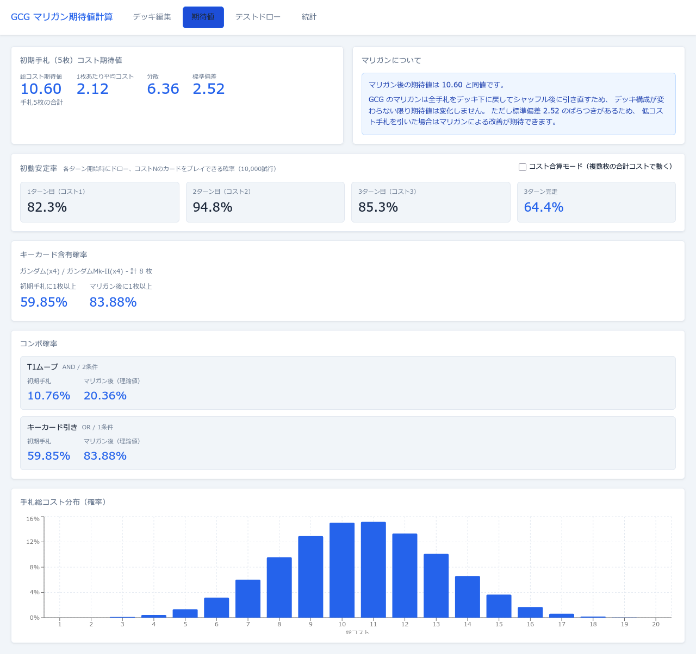
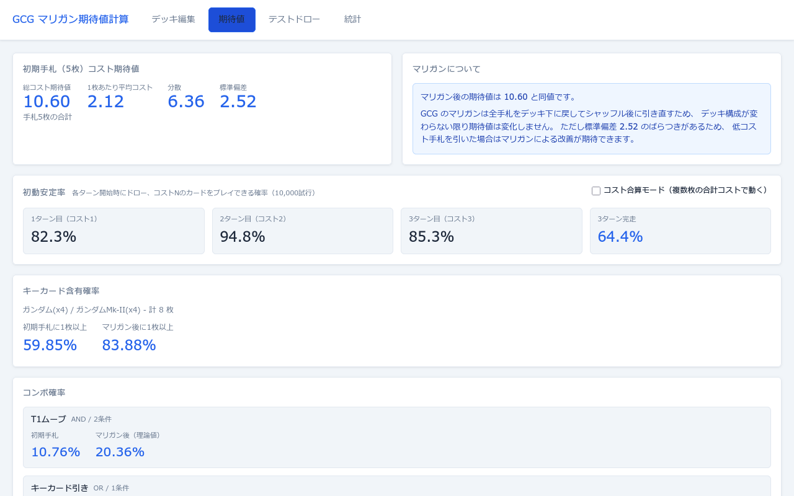

# 期待値タブ

選択中デッキの手札品質を数学的に分析する画面です。超幾何分布による厳密計算値とモンテカルロシミュレーションの結果を表示します。

**表示条件:** 選択中デッキが **50枚ちょうど** であること

---

## 画面全体

---

## コスト期待値カード（左上）

超幾何分布の期待値の線形性を利用して、初期手札5枚のコスト期待値を厳密計算します。

| 表示値 | 内容 | 計算式 |
|---|---|---|
| **総コスト期待値** | 初期手札5枚の合計コストの期待値 | `(5/50) × Σ(cost_i × n_i)` |
| **1枚あたり平均コスト** | 総コスト期待値を5で割った値 | 総コスト期待値 ÷ 5 |
| **分散** | 手札総コストのばらつきの大きさ | 超幾何分布の分散と共分散の和 |
| **標準偏差** | 分散の平方根 | √分散 |

---

## マリガンについてカード（右上）

マリガン後の期待値が初期手札と同値である理由を説明します。

| 表示内容 | 説明 |
|---|---|
| **マリガン後の期待値は X.XX と同値です** | 理論上、マリガン前後で期待値は変化しない |
| 理由の説明文 | GCGのマリガンは全手札をデッキ下に戻してシャッフル後に引き直すため、デッキ構成が変わらない |
| **標準偏差 X.XX のばらつき** | 標準偏差が大きいほど低コスト手札を引いた場合のマリガンによる改善が期待できる |

---

## 初動安定率カード

各ターン開始時にドローしてコストNのカードをプレイできる確率をシミュレーションで算出します（10,000試行）。

| 表示値 | 内容 |
|---|---|
| **1ターン目（コスト1）** | T1開始時に6枚の手札からコスト1のプレイが成立する確率 |
| **2ターン目（コスト2）** | T1プレイ後さらに1枚ドローした7枚の手札からコスト2のプレイが成立する確率 |
| **3ターン目（コスト3）** | T2プレイ後さらに1枚ドローした8枚の手札からコスト3のプレイが成立する確率 |
| **3ターン完走**（青色） | T1〜T3の全ターンでコスト通りに動けた確率 |

### コスト合算モード

| 要素 | 動作 |
|---|---|
| **コスト合算モード チェックボックス** | チェックするとコスト合算モードの数値に切り替わる。チェックを外すと通常モードに戻る。**切り替え時は再計算しない**（両モードはデッキ変更時に同時計算済み） |

**通常モードとの違い:**
- 通常モード: 手札にコストがぴったりのカードが1枚あればプレイ成立
- コスト合算モード: 複数枚の合計コストでも条件を満たせる（例: T2にコスト1+コスト1の2枚でも成立）

> T1の数値は両モードで必ず同じ値になります（コスト1は合算しても1枚のカードと同じ）。

---

## キーカード含有確率カード

キーカード（🔑マーク）が設定されているカードが初期手札に含まれる確率を表示します。

| 表示値 | 内容 | 計算式 |
|---|---|---|
| **キーカード一覧** | キーカードに設定されたカードの名前・枚数、デッキ内合計枚数K | — |
| **初期手札に1枚以上** | 初期5枚にキーカードが1枚以上含まれる確率 | `1 - C(50-K, 5) / C(50, 5)` |
| **マリガン後に1枚以上** | マリガンも考慮した累積確率 | `1 - (1 - P初期手札)²` |

キーカードが1枚も設定されていない場合は「デッキ編集画面で 🔑 を設定」というメッセージを表示します。

---

## コンボ確率リスト

デッキ編集タブで登録したコンボごとの初期手札成立確率を表示します。

| 表示値 | 内容 |
|---|---|
| **コンボ名** | 登録したコンボの名前 |
| **AND / OR・N条件** | 論理条件の種類と条件数 |
| **初期手札** | 50枚デッキから5枚引いたときにコンボが成立する確率 |
| **マリガン後（理論値）** | `1 - (1 - P初期手札)²` で算出したマリガン後確率の理論値 |

コンボが未登録の場合は「デッキ編集画面でコンボを登録してください」というメッセージを表示します。

---

## 手札総コスト分布チャート（最下部）

初期手札5枚の総コストが各値になる確率を棒グラフで表示します。

| 要素 | 内容 |
|---|---|
| **横軸** | 手札5枚の総コスト値 |
| **縦軸** | その総コストになる確率（0〜100%） |
| **棒グラフ** | 超幾何分布に基づく理論値。インタラクティブな操作なし |
