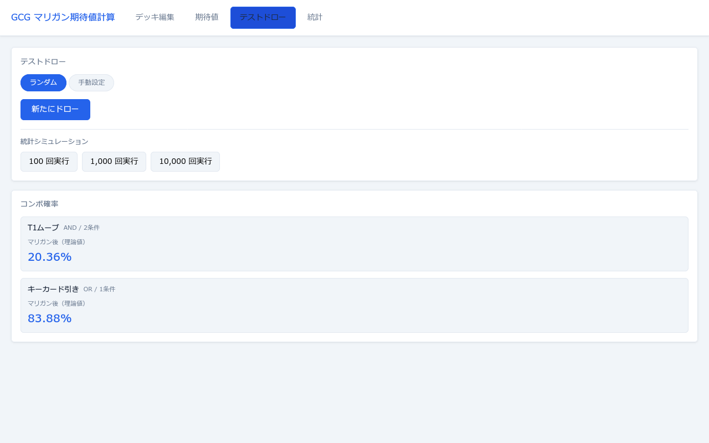
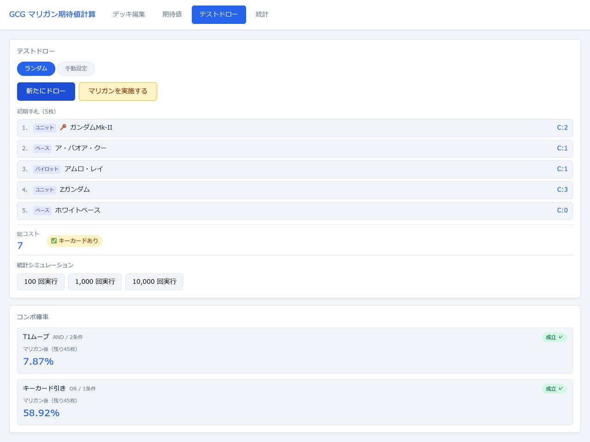
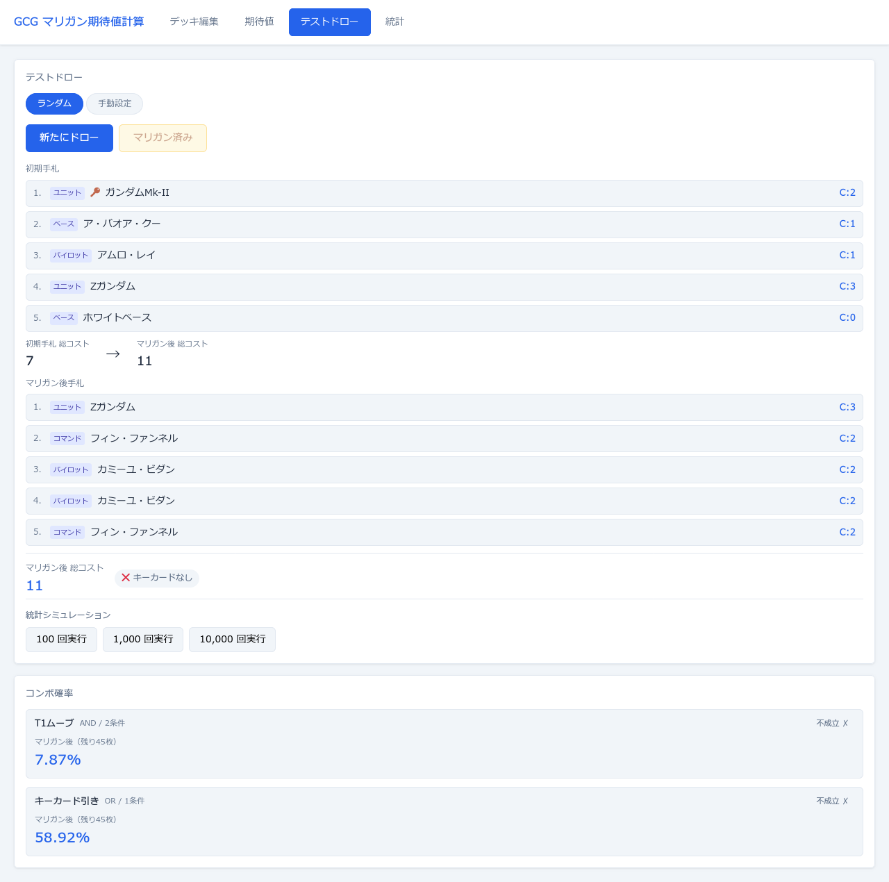
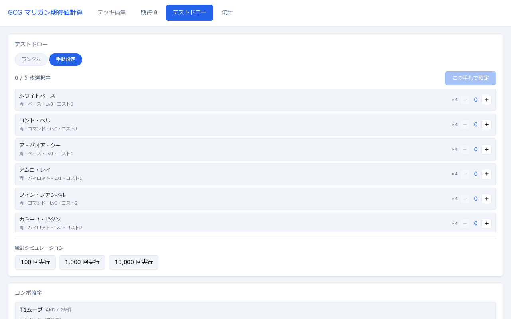

# テストドロータブ

仮想的な初期手札を引いてマリガンをシミュレートする画面です。ランダムドローと手動設定の2つのモードがあります。

**表示条件:** 選択中デッキが **50枚ちょうど** であること

---

## ランダムモード — ドロー前

| ボタン | 動作 |
|---|---|
| **ランダム**（左トグル） | ランダムドローモードを選択する（デフォルト） |
| **手動設定**（右トグル） | 手動設定モードに切り替える。切り替えると現在の手札とシミュレーション結果がリセットされる |
| **新たにドロー**（青） | Fisher–Yatesシャッフルで50枚デッキをシャッフルし、先頭5枚を初期手札として引く |

---

## ランダムモード — ドロー後

初期手札が表示された状態です。

### 手札表示

各カード行に以下が表示されます：

| 要素 | 内容 |
|---|---|
| **番号**（1〜5） | 手札内の連番 |
| **タイプバッジ** | カードタイプ（ユニット／パイロット／コマンド／ベース） |
| **🔑**（アイコン） | キーカードの場合のみ表示 |
| **カード名** | カードの名前 |
| **C:N**（右端） | カードのコスト値 |

### 手札サマリー（手札リスト下部）

| 表示値 | 内容 |
|---|---|
| **総コスト**（青い数値） | 手札5枚のコスト合計 |
| **✅ キーカードあり** / **❌ キーカードなし** | 手札にキーカードが含まれるかどうか |

### ドロー後に追加されるボタン

| ボタン | 動作 |
|---|---|
| **マリガンを実施する**（黄） | 全5枚をデッキに戻してシャッフルし、新たに5枚引く。**1回限り**。マリガン後はグレーアウトして「マリガン済み」と表示される |

### 統計シミュレーション

| ボタン | 動作 |
|---|---|
| **100 回実行** | 100回のシミュレーションを実行して集計結果カードを表示する |
| **1,000 回実行** | 1,000回のシミュレーションを実行して集計結果カードを表示する |
| **10,000 回実行** | 10,000回のシミュレーションを実行して集計結果カードを表示する |

実行中はボタンがすべてグレーアウトし「計算中…」と表示されます。実行後に画面下部に集計結果が表示されます（平均コスト・標準偏差・キーカード含有率）。

---

## ランダムモード — マリガン後

マリガンを実施した後の状態です。

| 表示内容 | 説明 |
|---|---|
| **初期手札 総コスト → マリガン後 総コスト**（比較表示） | 初期手札とマリガン後の総コストを並べて比較する |
| **初期手札**（上段） | マリガン前の5枚。表示のみ |
| **マリガン後手札**（下段） | 引き直した5枚 |
| **マリガン後 総コスト・キーカード有無** | マリガン後手札のサマリー |

### コンボ確率（マリガン後）

画面下部にコンボ確率リストが表示されます。

| 表示値 | 内容 |
|---|---|
| **コンボ名・AND/OR・条件数** | 登録済みコンボの情報 |
| **成立 ✓ / 不成立 ✗**（バッジ） | 現在の手札（マリガン後）でコンボが成立しているかどうか |
| **マリガン後（残り45枚）**（確率） | 初期手札5枚を除いた残り45枚デッキからの成立確率 |

---

## 手動設定モード

デッキ内のカードを自分で選んで5枚の手札を組み立てます。

| 表示内容 | 説明 |
|---|---|
| **N / 5 枚選択中** | 現在の選択枚数と目標枚数 |
| **カード一覧** | デッキ内の全カードをコスト昇順で表示。各行に色・タイプ・Lv・コスト情報を表示 |
| **x4**（デッキ枚数） | そのカードのデッキ内枚数 |

| ボタン | 動作 |
|---|---|
| **−** | そのカードの選択枚数を1減らす。0枚のときは押せない |
| **選択枚数**（中央の数値） | 現在の選択枚数。変更は−/＋ボタンで行う |
| **＋** | そのカードの選択枚数を1増やす。デッキ内枚数に達したとき、または合計が5枚に達したときは押せない |
| **この手札で確定**（右上、青） | 合計がちょうど5枚になったとき有効になる。押すと選択内容を初期手札として確定する |

確定後はランダムモードと同様にマリガンボタンと統計シミュレーションが使用できます。「再選択」ボタンで選択画面に戻ることができます。
