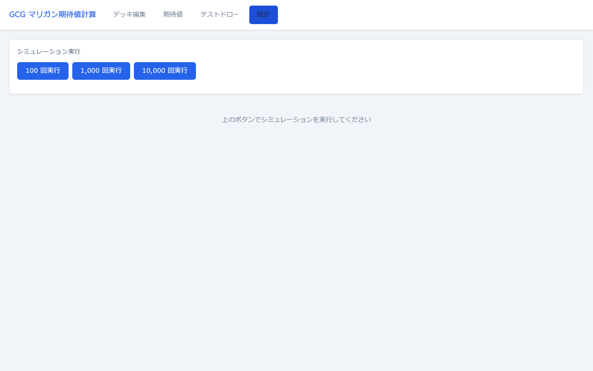
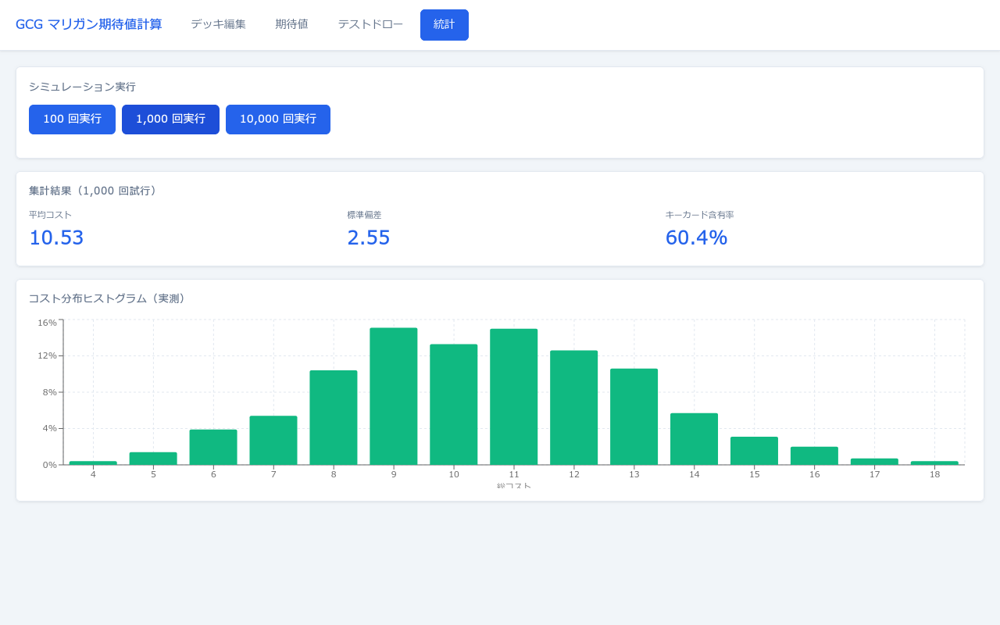

# 統計タブ

モンテカルロシミュレーションを実行して手札コストの統計データを集計・可視化する画面です。テストドロータブとは独立して動作します。

**表示条件:** 選択中デッキが **50枚ちょうど** であること

---

## シミュレーション実行前

| ボタン | 動作 |
|---|---|
| **100 回実行** | 100回の仮想ドローを行って集計する |
| **1,000 回実行** | 1,000回の仮想ドローを行って集計する |
| **10,000 回実行** | 10,000回の仮想ドローを行って集計する（推奨） |

実行中はボタンがすべてグレーアウトし「計算中…」と表示されます。UIのブロッキングを避けるため非同期で処理されます。

---

## シミュレーション結果

### 集計結果カード

| 表示値 | 内容 |
|---|---|
| **試行回数** | 実行したシミュレーション回数（例: 1,000 回試行） |
| **平均コスト**（青い数値） | 全試行での手札5枚の総コストの平均値 |
| **標準偏差**（青い数値） | コストのばらつきを表す指標。値が大きいほど手札の内容がランダムになりやすい |
| **キーカード含有率**（青い数値） | 手札5枚にキーカードが1枚以上含まれた試行の割合（実測値）。期待値タブのキーカード確率（理論値）と比較可能 |

### コスト分布ヒストグラム（実測）

| 要素 | 内容 |
|---|---|
| **横軸（総コスト）** | 手札5枚の総コスト値 |
| **縦軸（確率）** | そのコスト値になった試行の割合（0〜100%） |
| **棒グラフ（緑）** | シミュレーションの実測値。試行回数が多いほど期待値タブの理論分布に近づく |

> 期待値タブの「手札総コスト分布チャート」が理論値であるのに対し、こちらは実測値です。試行回数を増やすほど理論値に収束します。

---

## 再実行

別の試行回数でボタンを押すと結果が上書きされます。前回の結果は保持されません。
